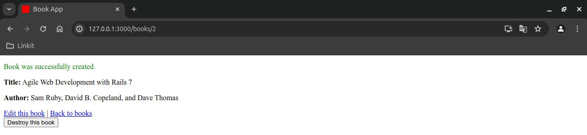

# BookApp

BookApp is Ruby on Rails application using SQlite database. This application will allow users to view books, add new books, update existing books, and delete books.

## Usage

To start your Rails server:

```sh
rails server
```




