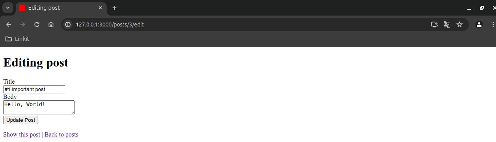

# Simple Blog

Simple blog is Ruby on Rails application using PostgreSQL database.

## Usage

To start the Rails server:

```sh
rails server
```
Open your web browser and go to `http://localhost:3000/posts` to see the blog application in action. You can create, read, update, and delete blog posts from this interface.




